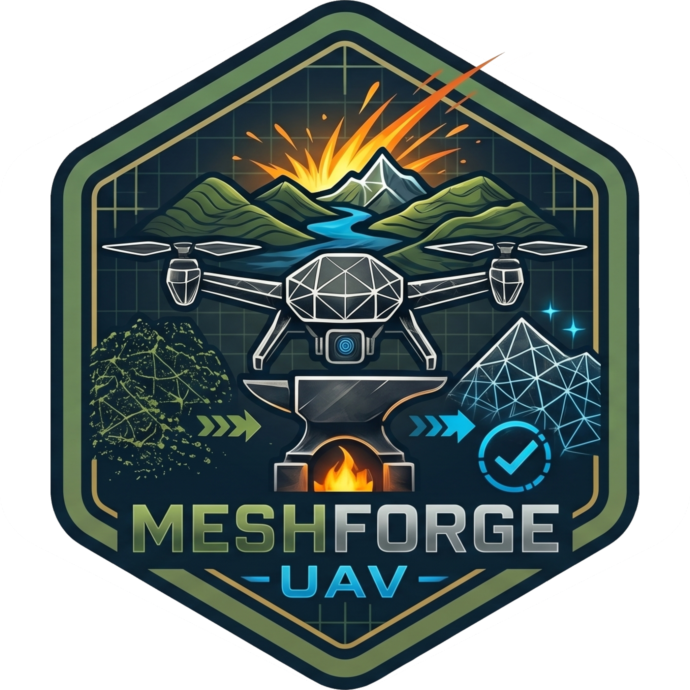

# MeshForge UAV

<p align="center">
  
</p>

MeshForge UAV is a Blender add-on for photogrammetry, LiDAR, terrain, and high-density mesh optimization workflows. It brings mesh cleanup, QEM simplification, quad retopology, UV generation, UV island packing, texture baking, LOD generation, and engine-ready export into one production-oriented sidebar panel.

## Package

- Add-on display name: `MeshForge UAV`
- Python package folder: `uav_optimizer`
- Blender version declared in the add-on: `4.5.10 LTS`
- Current add-on version: `0.2.3` pre-release
- Package type: Blender 3D View sidebar add-on
- Panel location: `View3D > Sidebar > MeshForge UAV`

## Current Workflow

The current supported panel flow is:

```text
-> MeshForge UAV / Mesh Pre-Processing
-> MeshForge UAV / QEM Simplification
-> MeshForge UAV / Quad Retopology
-> MeshForge UAV / Grid Seams
-> MeshForge UAV / UV Unwrapping
-> MeshForge UAV / Island Packing
-> MeshForge UAV / Texture Baking
-> MeshForge UAV / LOD Generation
-> MeshForge UAV / Engine Export
```

## Features

- Clean dense photogrammetry, LiDAR, scan, and terrain meshes before destructive processing
- Remove duplicate vertices, degenerate faces, spikes, and inconsistent mesh data
- Simplify meshes with Blender decimation, True QEM, or edge-length driven reduction
- Preserve the source mesh through rollback-safe simplification and LOD workflows
- Retopologize with QuadriFlow, QuadWild, Voxel Remesh, or terrain-oriented Grid Projection
- Generate grid seams without separating the source object
- Unwrap UVs through Blender-native Smart UV Project, Angle Based, Conformal, and Minimum Stretch flows
- Equalize texel density and report UV coverage, stretch, density, flipped faces, and out-of-bounds UVs
- Pack UV islands with Auto, UVPackmaster Addon, C++ Native, or Blender Native execution routes
- Prefer `UVPackmaster Addon -> C++ Native -> Blender Native` automatically in `Auto (Optimized)`
- Integrate UVPackmaster as a Blender add-on using the ZenUV-style store, transfer, invoke, and restore flow
- Group all UVPackmaster controls directly inside the main `Island Packing` panel
- Forward UVPackmaster margin, rotation, scale mode, lock overlapping, advanced heuristic, and heuristic timeout values
- Run UVPackmaster direct calls with a safe finite heuristic timeout when `Search Time` is zero
- Update packing statistics after UVPackmaster Addon, C++ Native, and Blender Native packing runs
- Build and use the native C++ UV packer through `uvpack_cpp`, `uvpack_lib`, and `build_uvpack.bat`
- Bake Albedo, AO, Normal, Roughness, Metallic, Emission, or full PBR map sets to PNG
- Reconnect baked maps automatically into Blender material node graphs
- Generate LOD0 as a real source copy, then build progressive LOD meshes in a dedicated collection
- Export active, selected, or generated LOD assets as FBX packages for Unreal Engine or Unity

## Packing Backends

```text
Algorithm                  Complexity profile       Quality              Speed              Ideal use
UVPackmaster Addon         external optimized solver highest              external solver    final UV packing in Blender
C++ Native MaxRects        O(n * f) placement search high                 fast               dense production assets
C++ Native Skyline         O(n log n) horizon search medium/high          very fast          quick atlas packing
C++ Native Pixel/Horizon   mask/raster collision path high for silhouettes moderate/fast      irregular island outlines
Blender Native             Blender operator runtime  reliable baseline    fast               fallback and compatibility
```

## Dependencies

Required:

- Blender `4.5.10 LTS`
- Python 3 runtime embedded in Blender
- Active mesh object with a UV map for UV packing, baking, and export stages
- Bundled `uvpack_lib` DLL artifacts generated from `uvpack_cpp`
- Bundled `quadwild_lib` binaries for QuadWild retopology

Optional but supported:

- UVPackmaster installed and enabled as a Blender add-on for the `UVPackmaster Addon` engine
- Visual Studio 2022 Build Tools on Windows for rebuilding the C++ UV packer

External requirements:

- Enough disk space for baked textures, generated LOD meshes, and exported FBX packages
- Windows is recommended for the QuadWild and native C++ packing paths currently present in this repository

## Installation

### ZIP Installation

1. Create a ZIP containing the `uav_optimizer` folder.
2. In Blender, open `Edit > Preferences > Add-ons`.
3. Click `Install...`.
4. Select the ZIP file.
5. Enable `MeshForge UAV`.

### Local Development

Copy or symlink this folder into Blender's add-on directory:

```text
%APPDATA%/Blender Foundation/Blender/<version>/scripts/addons/uav_optimizer
```

Then restart Blender or use `Refresh`, and enable `MeshForge UAV` in the add-ons list.

## Generated Project Data

MeshForge UAV primarily writes generated data into the active Blender scene or to user-selected output folders. Typical generated data is:

```text
Blender scene
|-- <Object>_LOD collection
|   |-- <Object>_LOD0
|   |-- <Object>_LOD1
|   `-- <Object>_LODn
Selected output folder
|-- baked PNG texture maps
|-- exported FBX package
`-- copied texture references
```

Folder and data summary:

- `<Object>_LOD`: generated LOD collection when the LOD stage runs
- `<Object>_LOD0`: real copy of the original source mesh
- `baked PNG texture maps`: outputs from the Texture Baking stage
- `exported FBX package`: output from the Engine Export stage
- `copied texture references`: optional texture copy folder for FBX export packages

## Native C++ Packer

Rebuild the native UV packer on Windows with:

```powershell
.\build_uvpack.bat
```

The script locates a compatible Visual Studio 2022 installation, builds `uvpack_cpp/uvpack.cpp`, and copies the versioned DLL artifacts into `uvpack_lib`.

## UVPackmaster Addon Integration

MeshForge UAV treats UVPackmaster as a Blender add-on installed by the user. The integration follows the same architectural model used by ZenUV:

```text
Detect add-on -> Select version gate -> Store UVPM props -> Transfer MeshForge UAV props -> Invoke bpy.ops.uvpackmaster3.pack() -> Restore UVPM props -> Update MeshForge UAV stats
```

Current behavior:

- Detects active UVPackmaster add-ons through Blender `addon_utils`
- Supports UVPackmaster 3 option sets through the active main props pointer
- Supports legacy UVPackmaster 3 and UVPackmaster 2 property paths where available
- Uses direct operator invocation to avoid opening the attached UVPackmaster window
- Saves and restores UVPackmaster settings after each run
- Provides `Sync to UVPackmaster` to copy settings without packing
- Enables `Advanced Heuristic` by default
- Applies a safe `10s` heuristic timeout for non-interactive direct UVPackmaster calls when `Search Time` is left at `0`
- Updates `Occupancy`, `Best Ever`, `Iterations`, `Time`, and `Method` after UVPackmaster packing

## Recent Changes

### 2026-04-29

- Renamed the add-on display name from `UAV Topology Optimizer` to `MeshForge UAV`
- Updated the Blender sidebar category to `MeshForge UAV`
- Added the `Documentation/Images/MeshForgeUAV.png` README header image
- Added `uvpm_addon.py` for ZenUV-style UVPackmaster add-on integration
- Added `UVPackmaster Addon` as an exposed packing engine
- Reduced the visible packing engine surface to `Auto`, `UVPackmaster Addon`, `Blender Native`, and `C++ Native`
- Updated `Auto (Optimized)` to prefer `UVPackmaster Addon`, then `C++ Native`, then `Blender Native`
- Grouped all UVPackmaster-related controls inside the `Island Packing` panel
- Moved shared UVPM controls into the main packing UI: margin, rotation, scale mode, lock overlapping, advanced heuristic, and search time
- Enabled `Advanced Heuristic` by default
- Added safe non-interactive UVPM heuristic timeout handling
- Added `Sync to UVPackmaster`
- Updated packing statistics after UVPackmaster add-on execution
- Preserved the existing subprocess bridge internally for compatibility, while removing it from the primary UI engine list
- Improved Blender Native no-op reporting
- Kept C++ Native packing with MaxRects, Skyline, Pixel Perfect, and Horizon Best Fit paths
- Kept existing `uav.*` operator identifiers and scene property names for `.blend` compatibility

### 2026-06-06

- Updated the declared Blender target to `4.5.10 LTS`.
- Hardened QEM simplification so generated meshes are validated before replacement.
- Preserved the high-poly source mesh data while leaving the source hidden and the QEM output visible/active.
- Removed QEM source backups; QEM now preserves the source and applies simplification only to the generated working copy.
- Kept QEM output generation when the requested target is already reached, producing a preserved working copy instead of deleting the result.
- Enforced QEM vertex targets for `VERTEX_COUNT` and `RATIO`, including the Fast Decimate fallback path.
- Added QEM pipeline metadata so simplified outputs cannot be used as high-poly bake sources.
- Reworked QEM target semantics: `RATIO`, `DENSITY`, and `TRIANGLE_COUNT` are enforced against source triangle count before cleanup, while `VERTEX_COUNT` remains vertex-based.
- Guarded QEM pre/post cleanup so an aggressive weld or degenerate cleanup on the working copy cannot undershoot the requested target.
- Triangulated QEM working copies before triangle-target Decimate and used temporary probe meshes to choose the closest result below the requested triangle target.

## Repository Layout

```text
uav_optimizer/
|-- __init__.py
|-- properties.py
|-- ui.py
|-- mesh_health.py
|-- qem_core.py
|-- uv_utils.py
|-- op_preprocess.py
|-- op_qem.py
|-- op_quadriflow.py
|-- op_quadwild.py
|-- op_shrinkwrap.py
|-- op_voxel.py
|-- op_seam.py
|-- op_uv.py
|-- op_packing.py
|-- uvpm_addon.py
|-- uvpm_bridge.py
|-- op_bake.py
|-- op_lod.py
|-- op_export.py
|-- uvpack_cpp/
|-- uvpack_lib/
|-- uvpm3_vendor/
|-- quadwild_lib/
|-- quadwild_util/
`-- Documentation/
    `-- Images/
        `-- MeshForgeUAV.png
```

## Documentation

- README entry page: [README.md](README.md)
- Header image: [Documentation/Images/MeshForgeUAV.png](Documentation/Images/MeshForgeUAV.png)

## Development

Quick syntax validation:

```powershell
python -c "import ast, pathlib; [ast.parse(p.read_text(encoding='utf-8')) for p in pathlib.Path('.').glob('*.py')]"
```

Recommended runtime validation:

1. Restart Blender or refresh add-ons.
2. Confirm the active add-on shown in preferences is `MeshForge UAV`.
3. Open `View3D > Sidebar > MeshForge UAV`.
4. Run `Island Packing` with `UVPackmaster Addon`.
5. Confirm that the statistics panel updates after packing.
6. Run `Island Packing` with `C++ Native`.
7. Run `Island Packing` with `Blender Native`.

Validated against Blender `4.5.10 LTS` at `C:\Program Files\Blender Foundation\Blender 4.5\blender.exe`.

## License

MIT. See [LICENSE](LICENSE).
